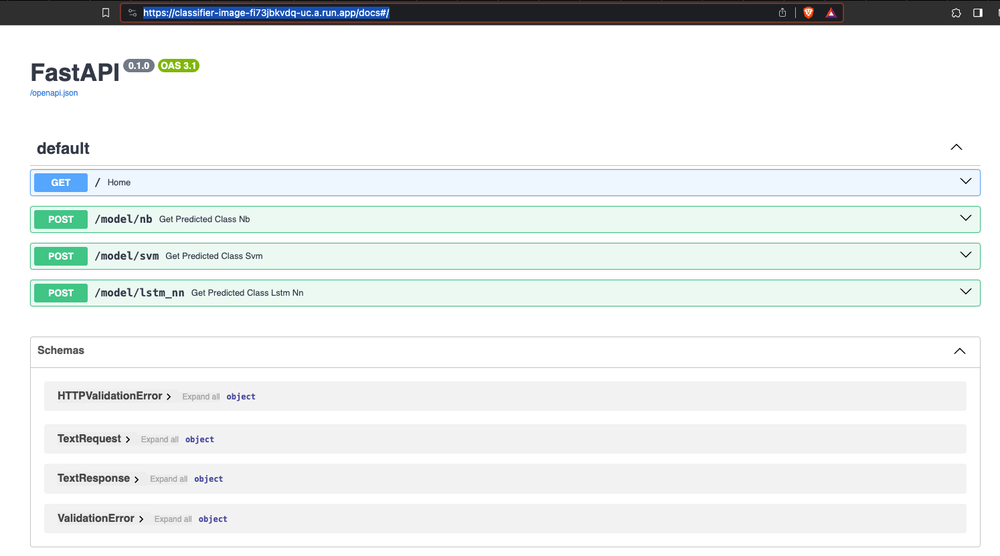

# German Short Phrase Classification

### 🚀 Access the Deployed Application 
Click 🔗 [Here](https://classifier-image-fi73jbkvdq-uc.a.run.app/docs#/) for the App API Docs




## Overview

This project provides an API for classifying German short phrases into predefined categories using three different models: **Multinomial Naive Bayes**, **SVM (Support Vector Machine)**, and a **Neural Network with LSTM (Long Short-Term Memory)**. It's designed to handle various types of text inputs and return the corresponding category predictions.

## Models

1. **Multinomial Naive Bayes (NavieBayes)**
2. **Support Vector Machine (SVM)**
3. **Neural Network with LSTM**

## API Endpoints

The API provides separate endpoints for each model:

- `POST /model/nb`: For predictions using the Multinomial Naive Bayes model.
- `POST /model/svm`: For predictions using the SVM model.
- `POST /model/lstm_nn`: For predictions using the Neural Network with LSTM.

### Request Format

The input text should be sent in the JSON format. It can be a single string or an array of strings.

Single text input:
```json
{
  "text": "Value"
}
```

Multiple text inputs:
```json
{
  "text": ["Value1", "value2"]
}
```

### Response Format

The API response includes the predicted category or categories in JSON format.

For a single text input:
```json
{
  "predictions": "<category>"
}
```

For multiple text inputs:
```json
{
  "predictions": [
    {"value1": "<category1>"},
    {"value2": "<category2>"}
  ]
}
```

## Preprocessing

The preprocessing steps include:

1. **Lowercasing**: Converts all text to lowercase to ensure consistency.

2. **Special Character Replacement**: German special characters (umlauts) such as ä, ö, ü, and ß are replaced with ae, oe, ue, and ss, respectively.

3. **Tokenization and Stemming**: Utilizes `nltk` for tokenization and the Stemmer for stemming the words, which helps in reducing the words to their root form.

## Usage

To use the API, send a POST request to the appropriate endpoint with the input text in the specified format. The API will return the category prediction(s) based on the selected model.

## Deployment
The FastAPI application has been containerized using a Dockerfile and 
then saved on Google's Artifact registory and then deployed on the Google Cloud Platform(Cloud Run), enabling easy access of the API.

## Conclusion
All 3 Model has the almost same accuracy, With this project ii understood 
factors to be considered while selecting appropirate model like computational resource, size of the data-set.. etc.

## References
[Machine Learching Models](https://medium.com/@alinatabish/machine-learning-techniques-for-spam-detection-in-email-7db87eb11bc2)
<br>
[Docker Deployement in GCP](https://medium.com/@taylorhughes/how-to-deploy-an-existing-docker-container-project-to-google-cloud-run-with-the-minimum-amount-of-daca0b5978d8)
<br>
[LSTM & Neural Network Reference](https://www.youtube.com/watch?v=VtRLrQ3Ev-U)
<br>
[Fast API](https://fastapi.tiangolo.com/#interactive-api-docs)
<br>
[GridSearch CV](https://www.analyticsvidhya.com/blog/2021/06/tune-hyperparameters-with-gridsearchcv/)


